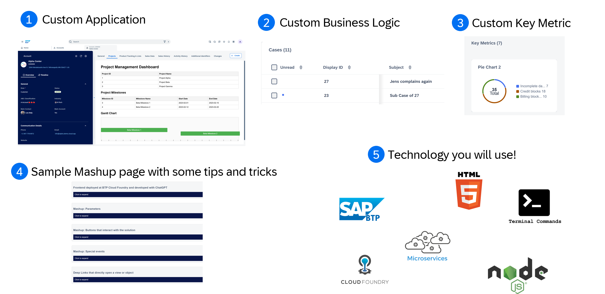
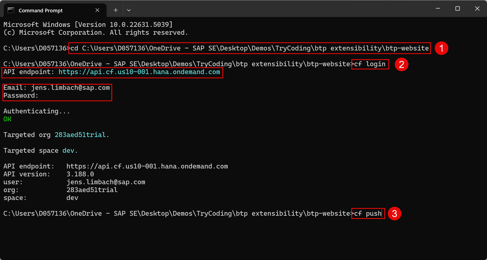
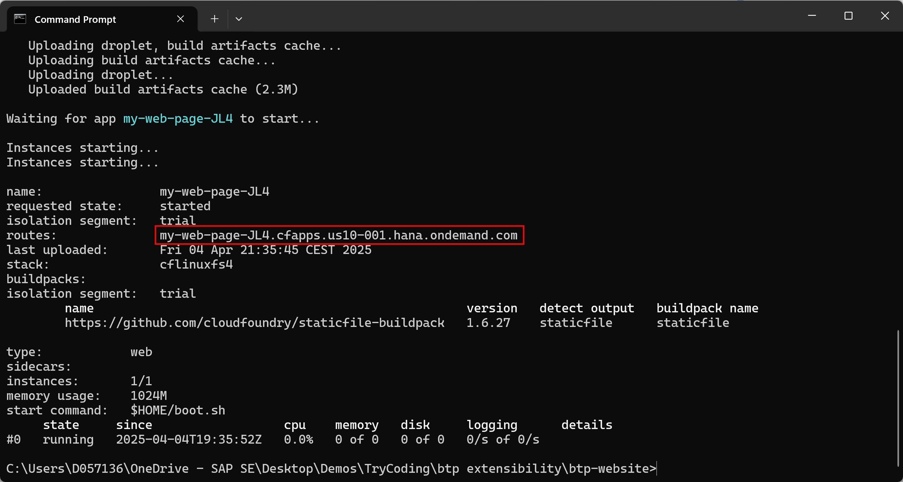
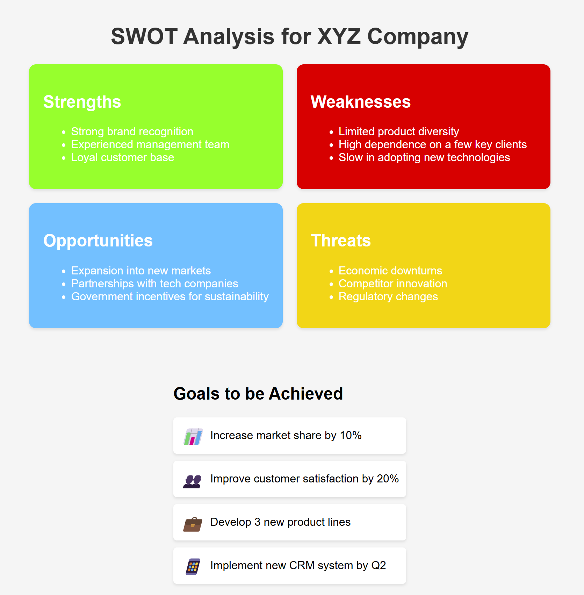
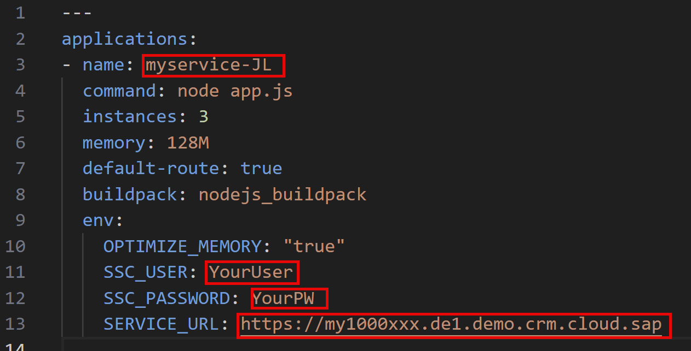
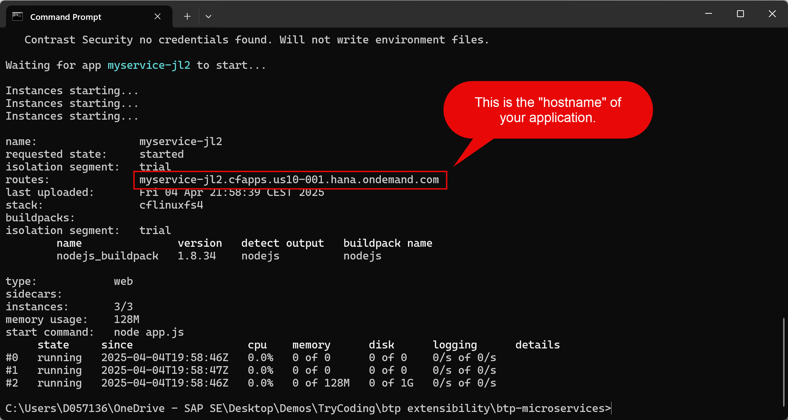

# SSv2 - Extensibility Workshop

Welcome to your first journey in creating side-by-side extensions for SAP Sales and Service Cloud Version 2 as a pro code developer! This guide will provide step-by-step instructions accompanied by live sessions, allowing you to get started with V2 development. After completing these steps, you’ll be able to develop:

- Basic applications embedded via mashup and generated with AI
- Microservices with small cloud functions with custom business logic
- Microservices with small cloud functions to extend the customer 360 with third-party data

This is really a beginners training to provide you with the very fundamentals. There is no rocket science here. :)

_Note: For beginners it is recommended to start with part 1 and not directly jump to any later chapter._

**Pre-requisites:**
- You should have admin access to a SAP Sales and Service Cloud Version 2 system.

After this you will have created and learned the following: 

## Table of Contents

- [Part 1: Deploying a Basic Website to BTP](#part-1-deploying-a-basic-website-to-btp)
- [Part 2: Deploying a Microservice with Cloud Functions](#part-2-deploying-a-microservice-with-cloud-functions)
- [Part 3: Deploying the Mashup-Sample Website](#part-3-deploying-the-mashup-sample-website)
- [Additional Resources](#additional-resources)
- [Contact](#contact)

## Part 1: Deploying a Basic Website to BTP
In the first part we will deploy a very basic website to BTP which "symbolizes" a powerful side-by-side application.

Before you start: My advise is to right-click and open all links below in a new tab so that you do not navigate away from the documentation. ;)

### Steps:

1. **Create a BTP Trial Account:**
- Create your own <a href="https://account.hanatrial.ondemand.com/" target="_blank">BTP Trial</a>, wait a bit and login.

2. **Prepare Your Local Environment:**
- Create a new folder named “btp extensions” on your computer and save the provided [ZIP file](https://github.com/jens-limbach/SSv2-extensibility-workshop/blob/2c6bdc7edcb9fdeaa133f66c78283e7915a1d972/SSv2-extension-workshop.zip) here.
  - The zip file contains: a pdf with the training overview and 3 folders with sample code which we will use as part of this training
  
3. **Unpack the ZIP File:**
- Unpack the ZIP file in your folder.

4. **Edit Manifest File:**
- Open the folder “btp-website” and edit the “manifest.yaml” by adding your own initials (i.e. "-JL") in this line `"- name: my-web-page-JL"`.

5. **Install Cloud Foundry CLI:**
- Download and install the Cloud Foundry Command Line Tool suitable for your OS.
  - Mac OS X 64 bit: [intel cpu](https://packages.cloudfoundry.org/stable?release=macosx64&version=v8&source=githubIntel) | [arm cpu](https://packages.cloudfoundry.org/stable?release=macosarm&version=v8&source=github) 
  - Windows 64 bit: [zip](https://packages.cloudfoundry.org/stable?release=windows64&version=v8&source=github)

6. **Command Line Setup:**
- Open the command line (cmd for Windows or terminal for Mac) and navigate to the folder using the command `cd`.
- i.e.: `cd C:\btp extensions\btp-website`

7. **Deploy to BTP:**
- Login using `cf login`, provide the necessary details (see below), and deploy your site using `cf push`.
- The api endpoint you find in your btp sub-account in the overview under "Cloud Foundry Enviroment", e-mail and password are the credentials you use for your btp trial (for SAP users, it is the SAP-All).

Until the `cf push` it should look similar to this:

After the `cf push` you will see the link under which your new website will be available, this you should copy for the next step.

8. **Test your first web site on BTP**
- After 'cf push' is finished, you will get a link and if you copy this into the browser you see your very first web-site deployed to BTP! This you could now already embedd as a mashup in SSv2.

9. **Create AI-Generated Content:**
- Now let's improve this very simple HTML page a little bit using any AI of your choice.
- Use any LLM AI platform to create a website and replace the HTML content of your site. If you work at SAP, I recommend you using the [AI Launchpad](https://sapit-core-playground-vole.ai-launchpad.prod.eu-central-1.aws.apps.ml.hana.ondemand.com/aic/index.html#/generativeaihub?workspace=sap-genai-xl&resourceGroup=default&/g/promptchat).
- i.e.: You can just prompt something like:
  >Create a website that shows a sample SWOT analysis for a large company from an account managers perspective. Make every quadrant of the SWOT Analysis with a different color. Also add a list of goals to be achieved with this account in the future. Add matching Unicode icons to the different goals. Everything should be included in a single HMTL page."

10. **Deploy Updated Website:**
- Execute `cf push` again to update your website on BTP. Then test again with the provided link.

In my last test with the LLM Mistral the generated website looked like below. Not very pretty, still static but for the effort we spend quite nice.

## Part 2: Deploying a Microservice with Cloud Functions
_Note: If you directly jumped here, there are a few pre-required steps described in part 1 like getting your BTP and downloading the [ZIP file](https://github.com/jens-limbach/SSv2-extensibility-workshop/blob/2c6bdc7edcb9fdeaa133f66c78283e7915a1d972/SSv2-extension-workshop.zip) we use in this tutorial._

Now that you know how to deploy applications to the BTP Cloud Foundry environment, follow these steps to create one microservice with two cloud functions.
- The first cloud function will have a "custom business logic" which can be called via an autoflow on save
- The second cloud function will contain the data stream necessary to feed the "custom key metrics" on the account overview

1. **Edit Your Manifest File:**
- Open the "btp-microservice" folder and edit the "manifest.yaml" file. This time you need to change a few things: add again your initials to the name, add your user, pw and SSv2 tenant url to the file

These attributes need to be adjusted by you:

2. **Deploy Microservice:**
- Open the command line, use `cd` to navigate to the folder and deploy your microservice with `cf push`. Copy the hostname of your application for the next step. Just that you know, the magic happens in the `app.js` file where we have defined two cloud functions (endpoints). One is called `/onCreateSubCase` and the other one is called `/customPieChart`. We will connect those two in the next step to our SAP Sales and Service Cloud Version 2.

After the `cf push` you should see a screen similar to this.

3. **Configure in Sales & Service Cloud:**
- Follow live instructions or refer to additional tutorials for custom business logic and key metrics setup.
  - For custom logic you can follow from step 3 onwards in this [tutorial](https://github.com/joek/async-sample). The only difference is that the `path` which is given in the autoflow will not be `/webhook` but will be `/onCreateSubCase`.
  - For the “custom key metrics” part: Go to Admin Settings, create a custom key metric, select the above created communication system and provide the `/customPieChart` endpoint of your microservice as a path.
 
After you have done the above steps you can test both functions. The custom logic happens when you create a new case and will automatically create a sub-case. The custom pie chart will be visible in your account overview.

## Part 3: Deploying the Mashup-Sample Website
_Note: If you directly jumped here, there are a few pre-required steps described in part 1 like getting your BTP and downloading the [ZIP file](https://github.com/jens-limbach/SSv2-extensibility-workshop/blob/2c6bdc7edcb9fdeaa133f66c78283e7915a1d972/SSv2-extension-workshop.zip) we use in this tutorial._

The mashup-sample website contains a few nice tipps and tricks what you can do to make your side-by-side applications nicer. It only works properly if you also embedd it as a mashup.

1. **Prepare and Deploy:**
- Use `cd` to navigate to the folder “btp-mashup-sample” and deploy using `cf push`.

2. **Configure Mashup:**
- Create a new mashup, add the URL given after the deployment and add two mashup parameters "param1" and "param2". 

3. **Binding Parameters:**
- You can either bind system variables in the mashup configuration (like logged user) or object variables during the UI adaptation (like account ID).
- Assumption: You know how to create new tabs in the adaptation mode and add mashups there.

## Additional Resources

- We plan to add more links to sources regarding the upcoming "custom services feature" and also on how to develop [full CAP applications](https://cap.cloud.sap/docs/get-started/) here which is the recommended way to build side-by-side applications.

## Contact

jens.limbach@sap.com
