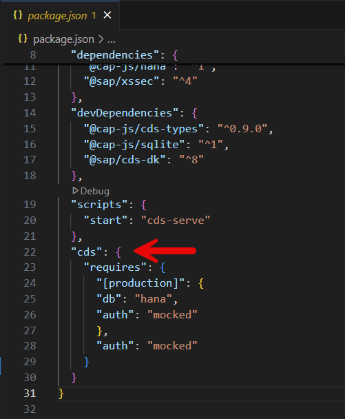
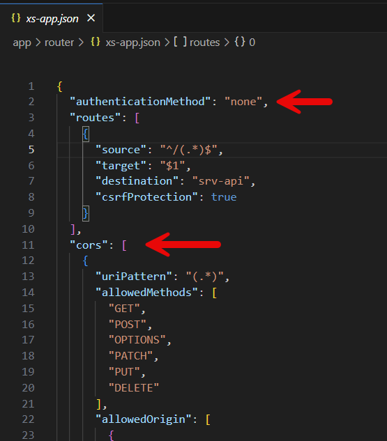
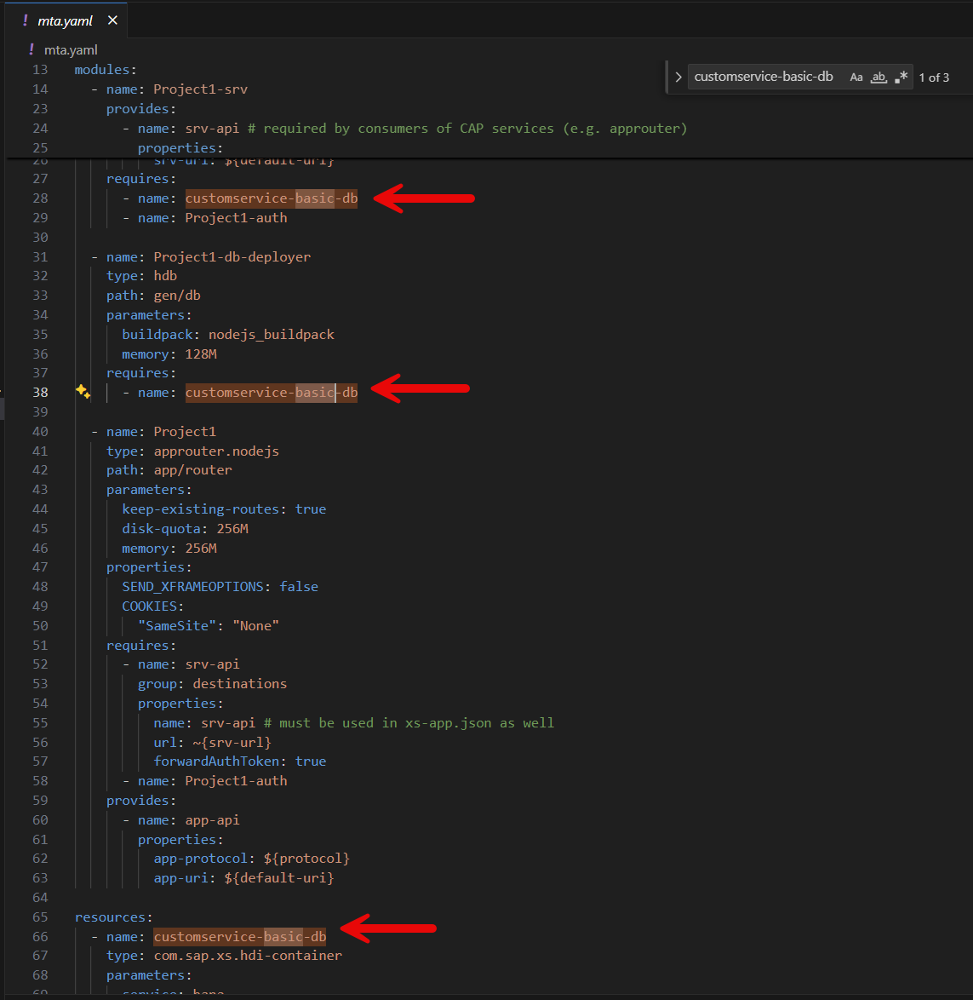

# Custom Services - Step by Step

These are the minimum steps for creating our own custom services application based on a CAP app from scratch.

📺**Video Tutorial**
You can either follow the steps below or watch the video (10 minutes) where I show each and every step needed in full detail.

-> [Video Tutorial - SSv2 Extensibility Workshop](https://sapvideo.cfapps.eu10-004.hana.ondemand.com/?entry_id=1_5r2suzns)

The video shows very nice all the detailed steps including both the CAP and also the Sales and Service V2 custom services part.

**Pre-requisites:**

- You have a BTP sub-account and access to Cloud Foundry
- You have setup a Hana Cloud on your BTP Sub-Account
- You have setup VSCode and done the initial setup for CAP
- You are a little bit familiar with coding or curious enough to get into it :)

**Step by Step Guide:**

1.	Open VSCode and the terminal
2.	Enter in the terminal “cds init ProjectOrder”
3.	Enter in the terminal  “code ProjectOrder”
4.	Create ```schema.cds``` file with your entity in the db folder -> Snippet 1

Snippet 1:
```
using {managed} from '@sap/cds/common';

namespace sap.capire.customservice;

entity ProjectOrder : managed {
    key id                   : UUID;
        name                 : String not null;
        customerName         : String;
        status               : String default 'ACTIVE';
        startDate            : String;
        endDate              : String;
        isIndividualCustomer : Boolean;
        customerEmail        : String;
}
```

5.	Create ```project-order-service.cds``` file in the srv folder with your service definition -> Snippet 2

Snippet 2:
```
using {sap.capire.customservice as projectorderschema} from '../db/schema';

service ProjectOrderService @(path: '/project-order-service') {

    @odata.draft.bypass
    entity ProjectOrder as projection on projectorderschema.ProjectOrder;
}
```

6.	Enter in the terminal
   
```cds add hana```

```cds add xsuaa```

```cds add mta```

```cds add approuter```

9.	Adapt some files manually…

-> Adjust the ```package.json``` (overwrite the cds section by changing auth to mocked and adding the hana db) -> Snippet 3


 
Snippet 3:
```
"cds": {
    "requires": {
      "[production]": {
      "db": "hana",
      "auth": "mocked"
      },
      "auth": "mocked"
    }
  }
```

-> Adjust the ```app/router/xs-app.json``` by adding CORS exceptions (for your tenant) and adjust authMethod=none -> Snippet 4 and 5


 
Snippet 4:
```
  "authenticationMethod": "none",
```

Snippet 5:

```
,
  "cors": [
    {
      "uriPattern": "(.*)",
      "allowedMethods": [
        "GET",
        "POST",
        "OPTIONS",
        "PATCH",
        "PUT",
        "DELETE"
      ],
      "allowedOrigin": [
        {
          "host": "localhost",
          "protocol": "http",
          "port": 5000
        },
        {
          "host": "localhost",
          "protocol": "http",
          "port": 4100
        },
        {
          "host": "localhost",
          "protocol": "http",
          "port": 4200
        },
        {
          "host": "ns-staging.cxm-salescloud.com",
          "protocol": "https"
        },
        {
          "host": "YOURTENANT.de1.demo.crm.cloud.sap",
          "protocol": "https"
        }
      ],
      "allowedHeaders": [
        "Accept",
        "Authorization",
        "Content-Type",
        "Access-Control-Allow-Credentials",
        "sap-c4c-rawagent",
        "X-Csrf-Token",
        "If-Match"
      ],
      "exposeHeaders": [
        "Etag",
        "X-Csrf-Token"
      ],
      "allowedCredentials": true
    }
  ]
```

-> Adapt the ```mta.yaml``` by changing the generated hana db name according to your own DB name (3 places in i.e. to “name: customservice-basic-db”) 



-> In case your BTP subaccount has spaces in it’s name: adjust the ```xsappname: ProjectOrder``` in your ```mta.yaml``` by removing the generated placeholders for subaccount and space.

-> Optional hint: Add 128M memory to all your services in ```mta.yaml``` to save some dev space

8.	Enter in your terminal
   
```npm update --package-lock-only```

```mbt build```

```cf login```

```cf deploy mta_file```

10.	Copy the app router url and try out your backend service.
    
12.	Enter in the terminal ```cds -2 json .\srv\projectorder-service.cds``` and copy the json into a new file.

13.	Create a new custom service entity in the Sales and Service Cloud V2 frontend, convert the CAP json file, download the final json definition and upload it in custom services
    
14.	Add UI’s to your custom service
    
15.	Assign it to your user via a business role
    
16.	Test!
