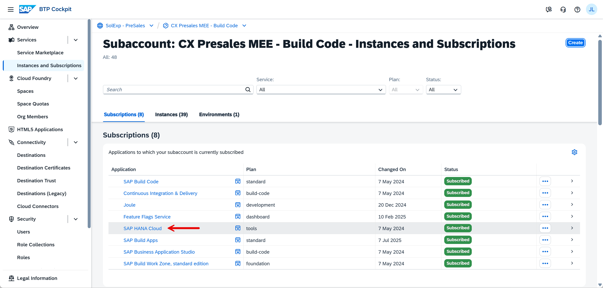
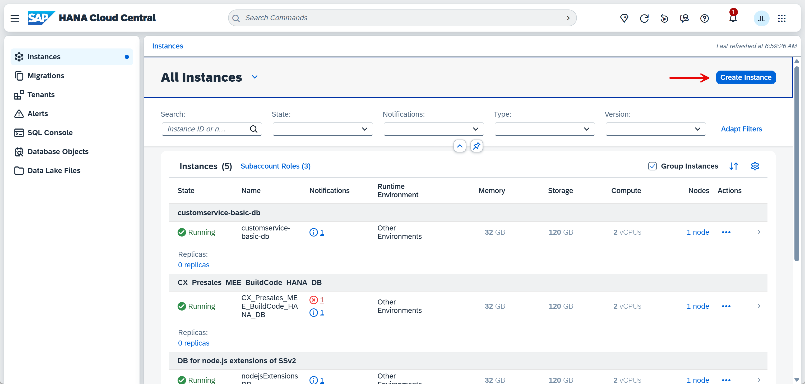
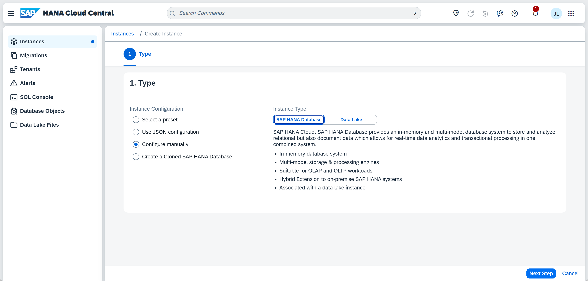
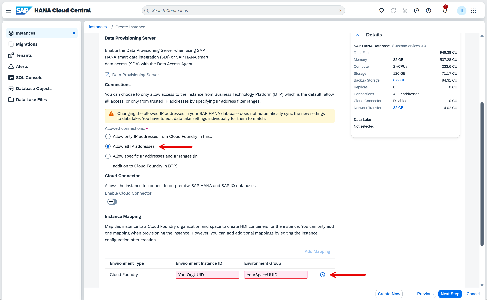

# HANA Cloud DB - basic steps

These are the basic steps to configure a new hana db for your CAP project. It might be that some are different for you but the most important ones you should find below.

1. Navigate to your instances in BTP and open your Hana Cloud (if you have none you need first to add it to your sub-account)

2. Create a new instance

3. Configure it manually

4. Set the DB name (this step is very important and the name must match the one given in your CAP project later)

5. Allow all IP Addresses and map your Cloud Foundry UUID and Space UUID (if you open your space you can find both in the URL)

6. Finish the db creation and wait until it is started. Please note that on a trial it is shut down every day.
